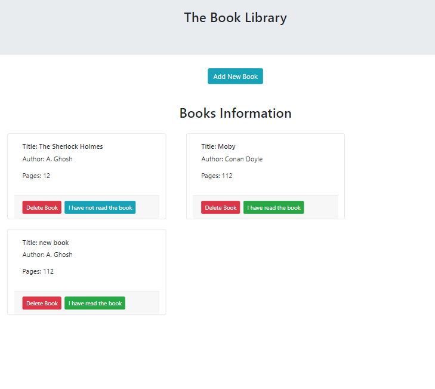

# Project: Library
This application was built as an introductory project to the Microverse Javascript module. The main focus was to exhibit the authors' basic understanding of the JavaScript programming language. Library is an application on which users can create a book, inputing the details about the book ( i.e title, author, number of pages, & whether they have read it or not). To achieve this, we made use of the localStorage to store all the information provided by the users of the browser & retrieve it whenever to display each book object in a structured way on the user's browser.

## Landing page



## Live Link

[Live demo](https://mylibrary123.netlify.app/)


## Technologies used:
- JavaScript programming language
- Bootstrap
- HTML & CSS
- localStorage
- .eslintrc (for validating js code).

## Setup the project on your machine:
To contribute to this project, run the following command on your terminal:
```
git clone https://github.com/Abhigyan001/Library.git
```

Once you have the cloned the project & you are still on the terminal, run:
```
cd Library
```

And run the app on your local machine in the browser of your choice.

## Authors

👤 ABHIGYAN Mahanta

- Github: [@Abhigyan001](https://github.com/Abhigyan001)
- Twitter: [@abhigyan_001](https://twitter.com/abhigyan_001)
- LinkedIn: [Abhigyan](https://www.linkedin.com/in/abhigyanmahanta/)

👤 Clayton Siby
- Github: [@Clayton Siby](https://github.com/ClaytonSiby)
- Twitter: [@ClaytonSiby](https://twitter.com/ClaytonSiby)
- Linkedin: [linkedin](https://www.linkedin.com/in/clayton-siby/)
- claytonsiby@gmail.com

## :handshake: Contributing

Contributions, issues and feature requests are welcome!
Feel free to check the [issues page](https://github.com/Abhigyan001/Library/issues).

## Show your support

Give a :star:️ if you like this project!

## Acknowledgments

TBA

## :memo: License

TBA
